# PriceSim: Navigating Markets with Probability Distributions

- [Context](#context)
- [Introduction](#introduction)
   + [Data exploring](big_query.ipynb)
- [Distributions](#distributions)
   + [Clustering](big_query.ipynb)
- [Conclusions](#conclusions)
   + [Conclusions](big_query.ipynb)

## *Context*

In the current context, the United States stands out as one of the world's leading oil exporters. Back in the 1990s, there were concerns about dwindling production. 

However, the introduction of shale oil revolutionized the industry, propelling the United States back into the ranks of major producers. This resurgence has significantly impacted the global energy landscape, with the U.S. now playing a vital role in supplying Europe with natural gas. 

The last factor is of utmost importance, given that numerous variables influence oil prices, such as weather conditions, concerns over supply disruption due to geopolitical conflicts or OPEC meetings, to name just a few. This is crucial because it directly impacts the price of oil and subsequently affects end-users, in the case of gasoline for our vehicles for example.
A notable example of this occurred in the spring of 2020 when the price of WTI plummeted into negative territory due to the COVID-19 pandemic. During this period, oil stocks in Cushing, Oklahoma reached full capacity, contracts were sold in negative values, and gasoline prices hit record lows. The question that arises is: Can we develop a method to model these scenarios and predict market movements? 

While it's extremely challenging to foresee such dramatic market crashes, we can attempt to model price behavior and generate scenarios that closely approximate reality. Making informed decisions based on these scenarios becomes imperative.

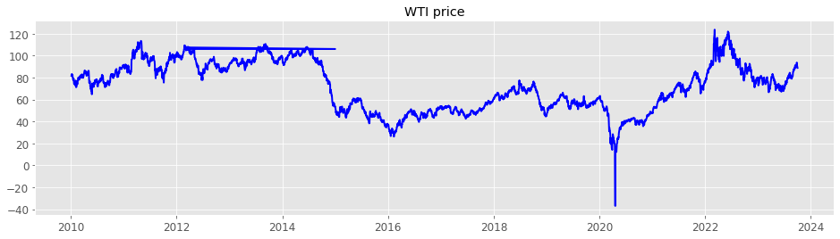

### Introduction

For the present analysis, we've considered price data from 2019. It's worth noting two significant price drops, the first occurring in 2015 and the more pronounced one in 2020. However, from the beginning of 2021, we observe a steady upward trend in prices. This can be attributed to two key factors:

- The reopening of countries following the COVID-19 pandemic
- The geopolitical situation, particularly the conflict involving Ukraine and Russia in Europe.

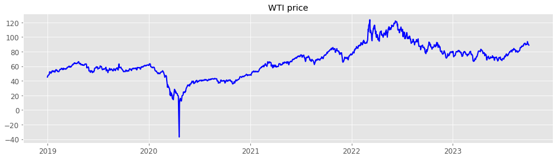

Continuing with the previous discussion, as evident in the following chart, the most substantial variation occurred in the spring of 2020, with the next significant difference noticeable until 2022.

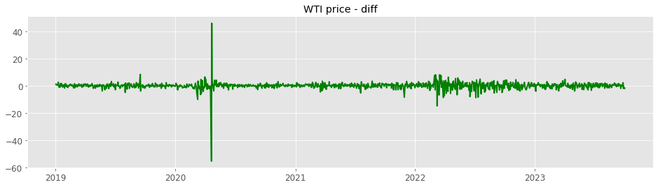

Now, to extract more insights from the data, we endeavor to decompose it into a time series. The primary objective is to determine if there are any seasonal patterns within the series that can aid in forecasting price movements.

*WTI price*

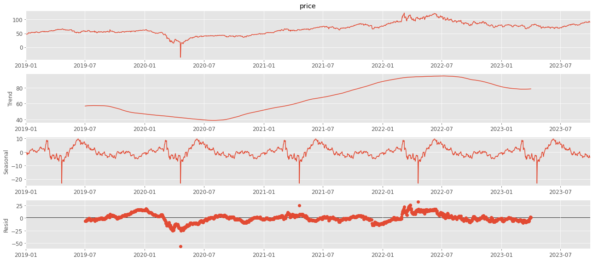

*WTI price variation*

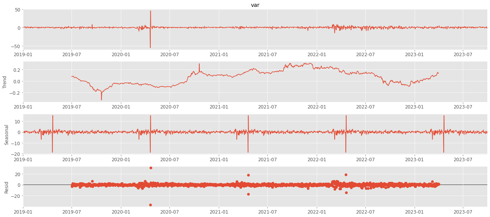

After a comprehensive analysis, we've detected distinct seasonality in both pricing and price variations. Nevertheless, it's important to acknowledge that this seasonality might be affected by the existence of outliers. To enhance the precision of our understanding, it is imperative that we take steps to address and minimize the influence of these outliers.

It's evident that these outliers have a substantial effect on our analysis. Our next approach will be to consider a logarithmic transformation. However, before proceeding with that, we'll first experiment with the *Winsor* technique.

*WTI price*

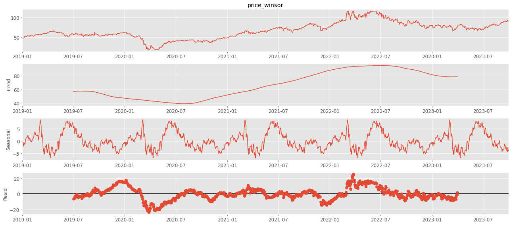

*WTI price variation*

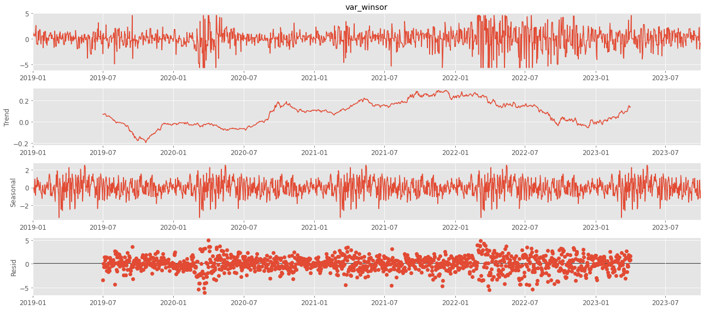

Examining the charts above, we've successfully *reduced the impact of outliers.* However, it's important to note that no distinct seasonal pattern can be assumed from the data. While we do observe a decrease in **prices** around May, it's primarily a result of the sharp drop in prices during the peak of the COVID-19 pandemic.

### Distributions

*`Context`* 

A probability distribution is a mathematical description of the potential outcomes of a random event. 
In simpler terms, it characterizes the likelihood of a random variable assuming specific values. Each conceivable value of the random variable is associated with a probability that signifies the likelihood of that value occurring.

Now that we have a grasp of what a *probability distribution* entails, let's proceed with our next objective is to continue the analysis of **prices** and their behavior. It is crucial to determine the type of distribution we are dealing with and with the next test aims to assess how closely the distribution resembles a normal distribution.

*WTI price*

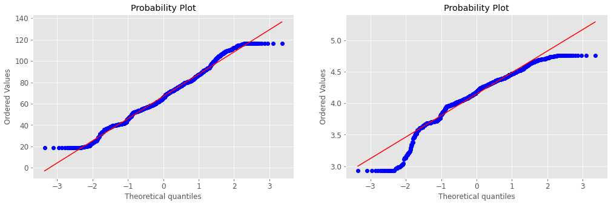

*WTI price variation*

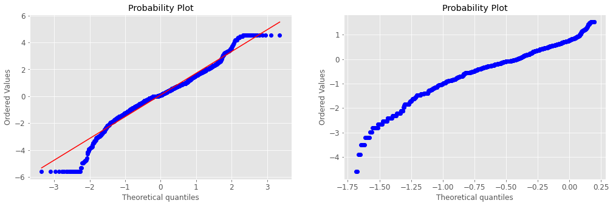

Our conclusion is that the distribution doesn't conform to a **normal distribution.**

*`Fitter package`*

But how do we determine which distribution best represents our data? This is a critical question as it helps us understand how to approach various scenarios based on the probability distribution and the likelihood of achieving the mean within those scenarios. To address this, we employ the *fitter package*, which conducts iterative approximations of the distribution until it identifies the closest match.

***WTI price variation***

As depicted in the following image, the data aligns most closely with the `Generalized Hyperbolic Distribution`. It's crucial to emphasize that we are analyzing price variations in this context.

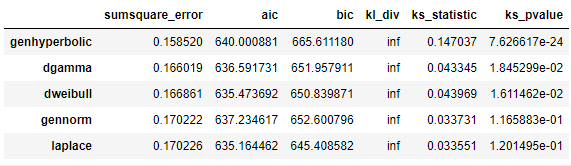

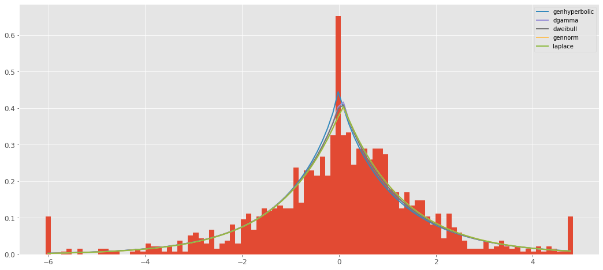

<!-- #region -->
***`hyperbolic distribution`*** 
The `generalised hyperbolic distribution` is a continuous probability distribution defined as the normal variance-mean mixture where the mixing distribution is the generalized inverse Gaussian distribution.

The Generalized Hyperbolic distribution is also applied to modeling commodity prices and real assets, such as real estate. In our specific case, this relates to WTI prices and it helps capture price patterns in these markets, including heavy tails and non-stationary fluctuations.
<!-- #endregion -->

***WTI price***

As we can observe in the following graph, the data closely resembles a `double gamma distribution`.

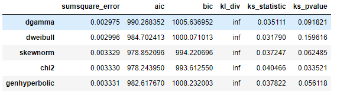

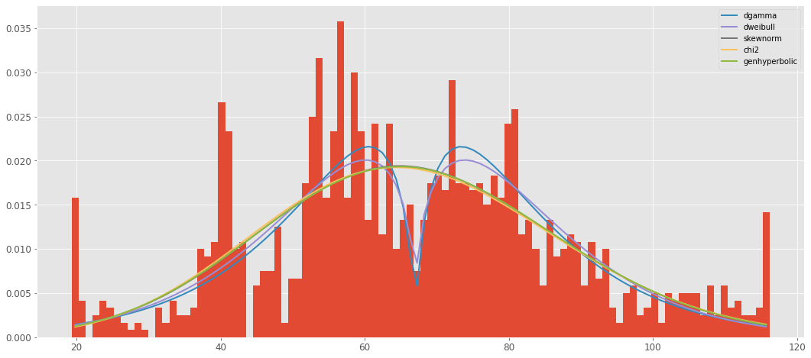

<!-- #region -->
***`double gamma`*** 
The `double gamma distribution` is a continuous probability distribution that finds applications in statistics, particularly in data modeling and survival analysis.

The double gamma distribution is frequently employed to model the time until an event occurs, such as the survival time of an electronic component. Additionally, it has been utilized to model the distribution of financial asset returns. It can also be applied in data analysis when the data distribution doesn't fit well with more common distributions, such as the normal distribution
<!-- #endregion -->

Now that we've identified the appropriate distributions, we can proceed to construct scenarios and evaluate associated risks. In this specific case, our focus will be on price variations rather than the absolute prices. To achieve this, we will employ ***Monte Carlo simulations.***

***Monte Carlo*** simulation is a robust statistical technique used for modeling and assessing the impact of various sources of uncertainty within a system. Its significance is particularly evident when it comes to simulating scenarios across diverse domains.

The following outlines why ***Monte Carlo*** simulation plays a pivotal role in scenario modeling:

- Handling Uncertainty: Real-world systems frequently involve inherent uncertainty and randomness. Monte Carlo simulation offers a method to incorporate this uncertainty into our models.

- Parameter Variability: Uncertainty can arise due to variations in parameters, market conditions, or other influential factors. Monte Carlo methods excel at navigating this variability and analyzing the range of potential outcomes.

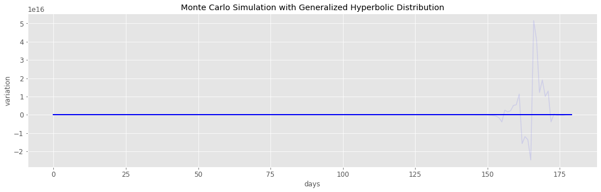

The chart above illustrates a 180-day simulation of price variations. The goal here is to replicate market fluctuations, enabling us to anticipate future trends and make well-informed pricing decisions.

Upon closer examination of the chart, it becomes apparent that the level of variation is quite high, potentially deviating significantly from actual price behavior. This raises concerns about the reliability of this simulation for decision-making.

A crucial aspect of this simulation is the occurrence of a significant price drop during the COVID-19 pandemic, which impacts all scenarios. As detailed in the accompanying notebook, we employ specific methods to address this issue. The objective is to minimize the influence of this anomaly, create an alternative representation of the true price distribution, and generate new scenarios for price simulations.

As indicated in the following boxplot, the majority of the data falls within the price range of **55 USD to 80 USD.** However, there are numerous outliers with values exceeding **100 USD** and falling below 30 USD. Notably, there is even a unique scenario where the price turns negative, as previously discussed.

To address the issue of outliers, we will apply a capping technique to remove data points considered atypical. Specifically, values below **20 USD and above 100 USD**, which are typically associated with exceptional circumstances, will be capped.

In this process, we will calculate the first quartile (Q1) and third quartile (Q3) values to establish upper and lower thresholds for data points. This step precedes the subsequent matching of the probability distribution."

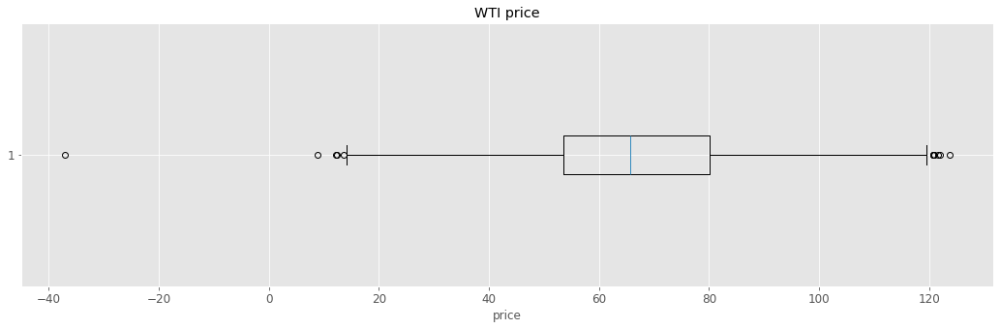

Upon comparing the capped prices with the original prices, we draw the following conclusion: the initially set limits aren't optimal for our approach. In this case, we've adjusted the limits to **20 USD** and **120 USD.** This adjustment is crucial as continuing with the current capped prices might introduce bias into our conclusions.

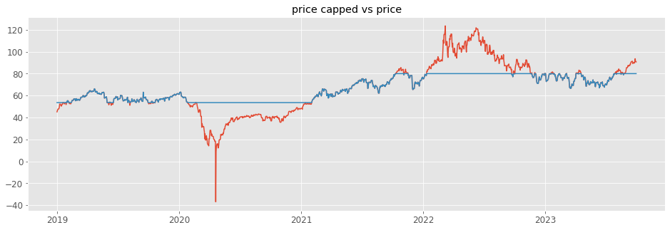

Now the price data appears more refined, allowing us to proceed. There are a few price points where data is capped, particularly in the lower range of prices.

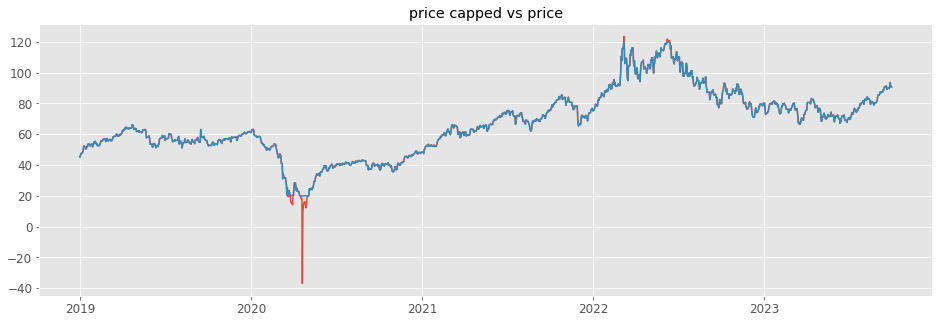

Although the optimal distribution is the double gamma, we have decided to choose the **skewness normal distribution** based on the following considerations.

- aic: The **Akaike Information Criterion (AIC)** is a measure that assesses the relative quality of a statistical model. **AIC** takes into consideration both the model's fitting ability and the amount of information it employs (number of parameters). The goal is to select the model with the lowest **AIC** value, indicating a good balance between fit and complexity.

- bic: The **Bayesian Information Criterion (BIC)** is a statistical measure employed for model selection. Similar to the Akaike Information Criterion (AIC), the **BIC** assesses the relative quality of models fitted to the data. However, it imposes a stronger penalty for model complexity.

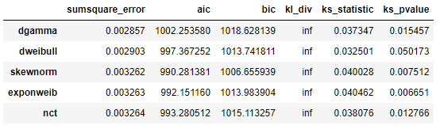

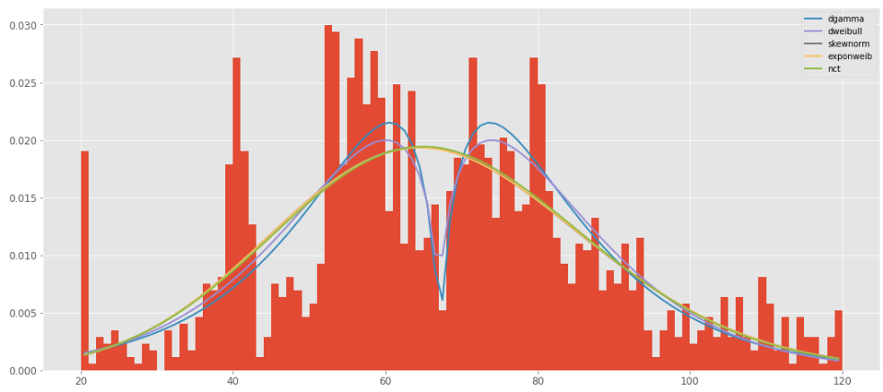

Once we have identified the most suitable distribution for our data, we can proceed to the next crucial step. To gain a better understanding of the potential scenarios, we will employ a **Monte Carlo simulation.** This simulation will provide valuable insights into how prices may behave over the next 180 days.

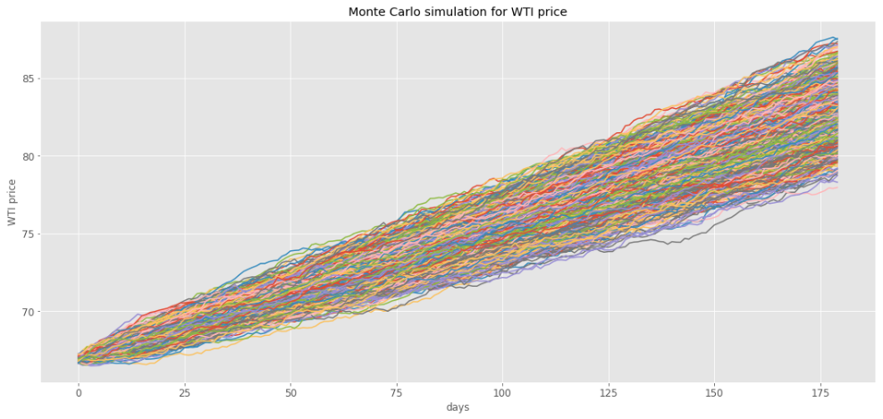

In conclusion, we have calculated a mean price of **74.6 USD** with a standard deviation of **4.7 USD.** While the mean provides us with an estimate of the expected price over the next 180 days, the significant standard deviation highlights the substantial variability in the data. In a business context, it's essential to recognize that a movement of **4 USD** can be attributed to major geopolitical events or other factors that directly impact the supply chain.

### Conclusions

In the previous sections, I've introduced a method for aligning our data distribution. This step is crucial as it allows us to gain a more accurate understanding of the probability of various events occurring. Coupled with **Monte Carlo simulations**, this approach provides valuable insights into potential future scenarios, enabling us to make more informed decisions.

In this particular case, our analysis suggests that over the upcoming days, we can anticipate a consistent growth in prices, with a projected average of **74 USD**. Armed with this information, we can consider taking future contracts accordingly.

However, it's essential to acknowledge the inherent unpredictability in the market. Events like the COVID-19 pandemic have demonstrated their capacity to drastically impact prices, leading to significant fluctuations. On the flip side, some events, such as geopolitical conflicts, can be anticipated and leveraged to our advantage when trading WTI futures.

Moving forward, it's imperative to factor in financial risk assessment as we proceed with projects or operations of this nature.
